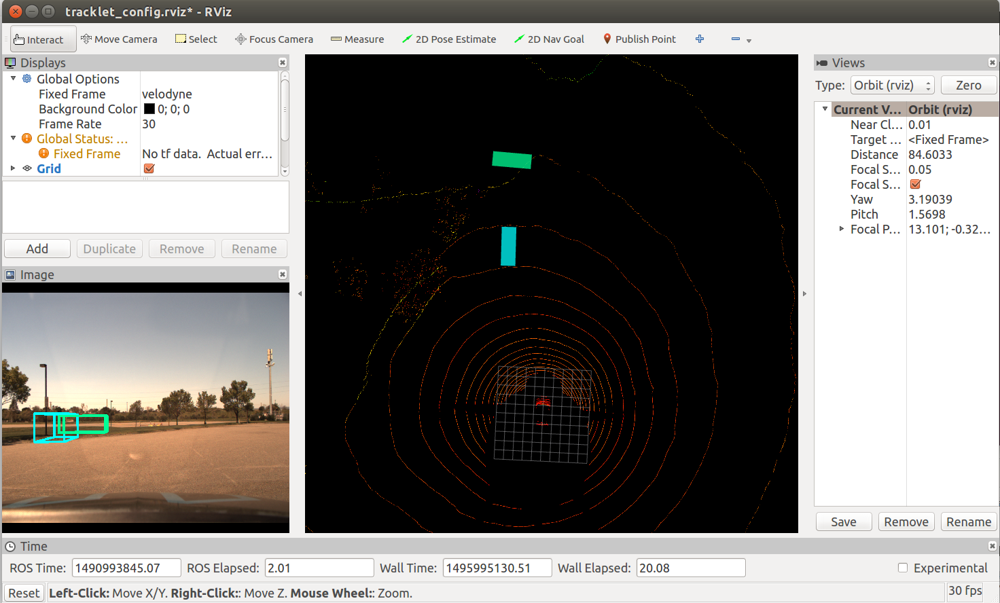
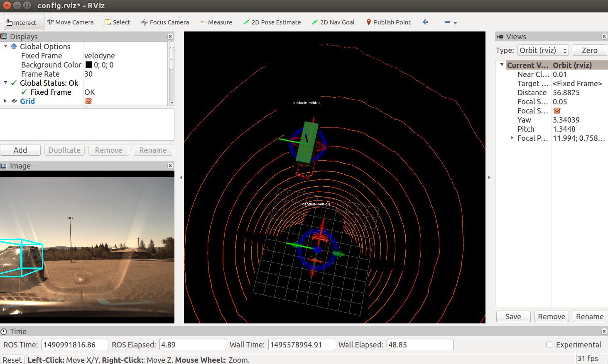

## Bounding box visualization for DiDi 

### Required ROS packages
* rviz
* velodyne

## Instructions
* Run `roscore`

* Download the project to the `src` of your catkin workspace. For example,
```
cp -r projection ~/catkin_ws/src/
cd ~/catkin_ws/src/projection
```

* Make sure all python files in source directory (`~/catkin_ws/src/projection/scripts/*.py`) are executable. 
Use the command `chmod +x` for this step.

* Build the catkin package followed by `source ~/catkin_ws/devel/setup.bash`. 
This last step has to be performed for every new terminal.

There are several options for visualizing : 

*  **Tracklet visualization only**

This is the recommended method for visualizing obstacles as it can handle multiple obstacles. This is ideal for visualizing test set or training set if no manual interaction is required.

To play the rosbag with bounding box visualization on camera and lidar using tracklets, first open `launch/tracklet.launch` and set the paths for bag and tracklet file. Then run :
```
roslaunch launch/tracklet.launch bag:=<bag_group>/<bag_id>
```
For example, to play bag 6_f.bag in folder 1, use 
`roslaunch launch/tracklet.launch bag:=1/6_f`. 

Bag plays at a default rate of 0.1, you can set it to a different value using 
`roslaunch launch/tracklet.launch bag:=1/6_f rate:=0.5`  

It is also possible to specify frame offset. In particular, the test set has an offset of 16 frames. So, additionally specify `offset:=16` in the `roslaunch` command. 
Please see `launch/tracklet.launch` for more details.

Here is a screenshot using round 1 test bag :
 


*  **Tracklet visualization and interaction**

This option is ideal if you want to visualize tracklets as well as manually interact to correct offsets. However, it is less robust and can only handle one obstacle. 

First set directory paths in  `launch/tracklet_interact.launch` and then run :
```
roslaunch launch/tracklet.launch bag:=<bag_group>/<bag_id>
```
As before, look at `launch/tracklet_interact.launch` for more options.

The interactive markers in the rviz window will allow you to rotate and translate with respect to origin (of velodyne frame) as well as to rotate bounding box with respect to obstacle vehicle. 

* As you manually interact with the markers, projection on camera plane will be automatically modified. 

* To view the final transformations, use 
```
rostopic echo /obstacle_marker/feedback 
```
If `marker_name` is  `capture vehicle`, it corresponds to rotation/translation about velodyne frame. If `marker_name` is `obstacle vehicle`, it corresponds to rotation about obstacle vehicle centroid. Record the `pose` which can then be used for training. 

Here is a sample output from one of the training bags :
 
 
 *  **Visualization and interaction using GPS**
 
 This final option is similar to previous one, except that it directly uses GPS information from obstacle to find bounding boxes instead of using tracklet files.
 
To play the rosbag : 
```
roslaunch launch/projection.launch bag:=<absolute_path_of_bag_file> rate:=<rate(default=0.1)>
```


*Note* :  You may get an error `ROS time moved backwards` which can be safely ignored. This error is caused because the rosbag is played in loop. 

